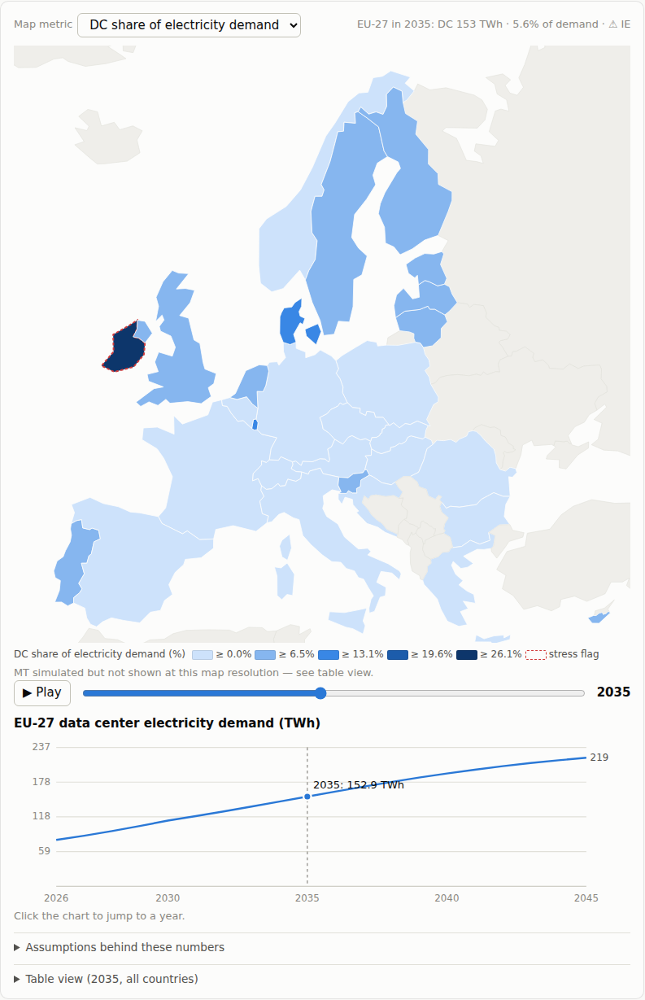
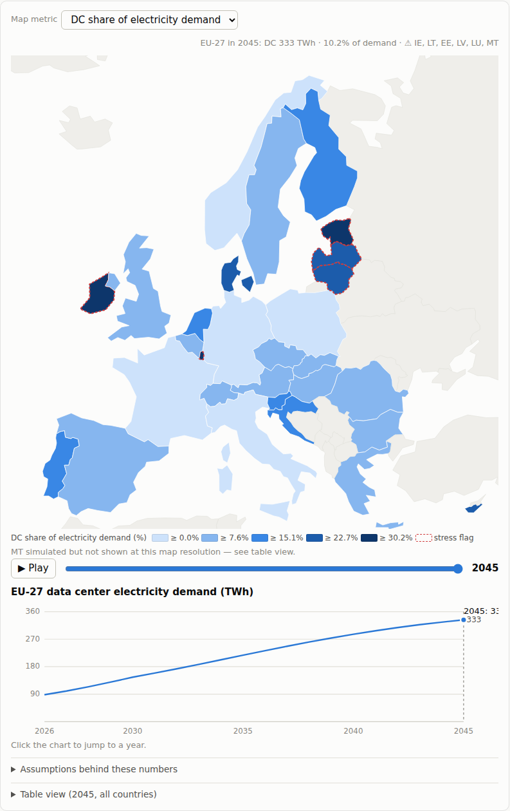
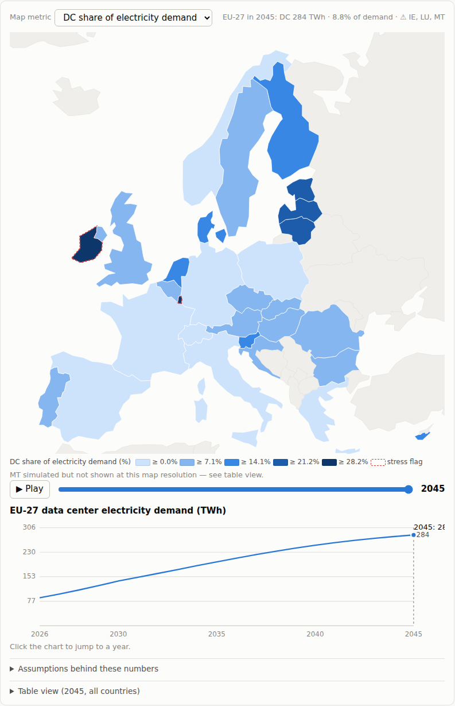
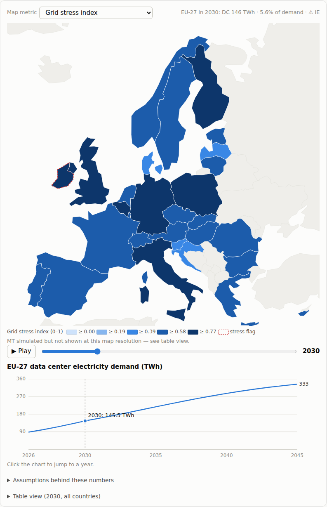

# Fallstudien mit dem Energie-4-AI-Simulator (P1-MVP)

**Stand:** 2026-07-04 · App-Commit `0940e4c` · Datenbundle v1.0.1 · Erzeugt mit dem
P1-Interface (Browser-Automation via Playwright, Chromium headless). Alle Zahlen in diesem
Dokument wurden **aus der Benutzeroberfläche abgelesen** (Kopfzeile und Tabellenansicht),
nicht aus dem Modellcode extrahiert — sie sind mit den drei Hebeln des Szenario-Panels
von Hand reproduzierbar.

> ⚠️ **Einordnung (Modellgrenzen):** Jahresenergiebilanzen auf einem vereinfachten
> NTC-Netz — kein Lastfluss, keine untertägige Auflösung; Länderauflösung (Hubs sind
> Metadaten); viele Länderparameter sind als `expert-guess` markierte Näherungen
> ([Issue #4](https://github.com/Tobias-Run/Energie-4-AI/issues/4)). Die Szenarien sind
> **Explorationswerkzeuge, keine Prognosen.** Quellen je Parameter: `sources.bib` via
> Assumptions-Drawer; Datennutzung: [DISCLAIMER.md](DISCLAIMER.md).

---

## 0. Interface-Testprotokoll

Vor den Fallstudien wurde das Interface vollständig durchgetestet — Bedienung per Maus
**und Tastatur** (Barrierefreiheits-Pfad). Ergebnis: **14/14 bestanden**, keine
Konsolen- oder Seitenfehler während des gesamten Durchlaufs.

| #   | Test                                                                           | Ergebnis |
| --- | ------------------------------------------------------------------------------ | -------- |
| 1   | App lädt, Header zeigt Startjahr 2026                                          | ✅       |
| 2   | Metrik-Umschaltung aktualisiert Karte + Legende                                | ✅       |
| 3   | Zeitschieber per Tastatur: `End` → 2045                                        | ✅       |
| 4   | Zeitschieber per Tastatur: `Home` → 2026                                       | ✅       |
| 5   | Play/Pause animiert die Jahre (2026 → 2028 nach ~1,4 s)                        | ✅       |
| 6   | Hover-Tooltip auf Länderfläche (Irland) mit Detailwerten                       | ✅       |
| 7   | Assumptions-Drawer öffnet, zeigt `source_id`s inkl. `expert-guess`             | ✅       |
| 8   | Tabellenansicht listet alle 30 Länder (inkl. Malta, das die Karte nicht zeigt) | ✅       |
| 9   | Compute-Hebel per Pfeiltasten präzise auf ×1,75                                | ✅       |
| 10  | Effizienz-Hebel per Pfeiltasten präzise auf 2,0 %/Jahr                         | ✅       |
| 11  | Reform-Toggle aktivierbar                                                      | ✅       |
| 12  | Reset stellt das zentrale Szenario wieder her                                  | ✅       |
| 13  | Story-Modus: 5 Schritte bis 2045, setzt Hebel und Metrik korrekt               | ✅       |
| 14  | Keine JavaScript-Fehler im gesamten Durchlauf                                  | ✅       |

Jeder Hebelzug rechnet die komplette 20-Jahres-Simulation neu (2–6 ms, clientseitig).

---

## Fallstudie 1 — „Compute-Boom trifft Effizienz"

**Frage:** Was passiert, wenn die globale KI-Nachfrage 75 % über dem IEA-Basispfad
wächst — und wie viel davon können zusätzliche Effizienzgewinne der Rechenzentren
(bessere Kühlung, bessere Auslastung, effizientere Chips) wieder einfangen?

**Hebel:**

| Szenario              | Compute-Wachstum | Zusatz-Effizienz | Permitting       |
| --------------------- | ---------------- | ---------------- | ---------------- |
| Zentral (Referenz)    | ×1,00            | 0,0 %/Jahr       | Baseline (~9 J.) |
| A1 „Boom"             | ×1,75            | 0,0 %/Jahr       | Baseline         |
| A2 „Boom + Effizienz" | ×1,75            | 2,0 %/Jahr       | Baseline         |

**Ergebnis (EU-27, aus der UI-Kopfzeile):**

| Kennzahl          | Zentral         | A1 Boom                    | A2 Boom + Effizienz |
| ----------------- | --------------- | -------------------------- | ------------------- |
| DC-Nachfrage 2035 | 153 TWh (5,6 %) | 217 TWh (7,7 %)            | 200 TWh (7,1 %)     |
| DC-Nachfrage 2045 | 219 TWh (7,0 %) | **333 TWh (10,2 %)**       | **284 TWh (8,8 %)** |
| Stress-Flags 2045 | IE              | **IE, LT, EE, LV, LU, MT** | IE, LU, MT          |

**Befunde:**

1. **Der Boom verdreifacht fast den DC-Anteil an der EU-Stromnachfrage** gegenüber heute
   (~3 % → 10,2 % in 2045) und hebt die Nachfrage um +114 TWh über den Zentralpfad —
   das entspricht grob dem heutigen Jahresverbrauch der Niederlande.
2. **Der Stress wandert in die kleinen Systeme.** Unter Boom-Bedingungen kippen 2045
   neben Irland auch **Litauen, Estland, Lettland, Luxemburg und Malta** in den
   Stress-Flag: Der Spillover-Mechanismus verteilt Last, die in den verstopften Hubs
   keinen Netzanschluss findet, auch in kleine Bidding-Zonen — dort überschreitet die
   firme Inferenz-Last schnell 15 % der Spitzenlast. Große Systeme (DE: 42 TWh DC in
   2045, 7,4 %) verdauen den Boom dagegen ohne Flag.
3. **2 %/Jahr Zusatz-Effizienz kauft ~50 TWh zurück** (333 → 284 TWh in 2045, −15 %)
   und **nimmt das Baltikum wieder von der Stress-Liste** — Effizienzpolitik wirkt im
   Modell also weniger auf die Gesamtkurve als auf die Ränder, wo Flags kippen.
4. **Irland bleibt in jeder Welt geflaggt** (37,8 % DC-Anteil an der Nachfrage in 2045
   unter Boom, 35,2 % mit Effizienz): Bestandslast dominiert; Effizienz bei
   _Neuzugängen_ ändert daran wenig.


_Referenz: Zentralszenario 2035 — DC-Anteil an der Stromnachfrage, Irland geflaggt._


_A1 „Boom" 2045: 333 TWh, 10,2 % — Baltikum, Luxemburg und Malta zusätzlich geflaggt (rot gestrichelt)._


_A2 „Boom + Effizienz" 2045: 284 TWh, 8,8 % — das Baltikum ist wieder unter den Schwellwerten._

---

## Fallstudie 2 — „Grids Package unter Boom-Bedingungen: Wer bekommt die Last?"

**Frage:** Die europäische Permitting-Reform („Grids Package", Genehmigung ~9 → ~5 Jahre)
soll den Netzanschluss beschleunigen. Ändert sie, _wie viel_ KI-Last Europa anschließt —
oder _wo_ sie landet? Getestet unter Boom-Bedingungen (×1,75), damit die Anschluss-Pipelines
überhaupt binden.

**Hebel:** B1 = Boom ohne Reform · B2 = Boom mit Reform (sonst identisch).

**Ergebnis (aus der UI-Tabellenansicht, Metrik Stress-Index):**

| Kennzahl                  | B1 ohne Reform           | B2 mit Reform                |
| ------------------------- | ------------------------ | ---------------------------- |
| EU-27 DC 2030 / 2035      | 146 / 217 TWh            | 146 / 217 TWh _(identisch)_  |
| Irland: DC 2030           | 11,3 TWh (Queue 0,01 GW) | **12,4 TWh (Queue geleert)** |
| Irland: DC 2035           | 15,6 TWh                 | 16,8 TWh                     |
| Irland: Stress-Index 2030 | 0,82                     | 0,84                         |
| Schweden: DC 2035         | 16,7 TWh                 | 16,6 TWh                     |
| Spanien: DC 2035          | 14,8 TWh                 | 14,7 TWh                     |
| Norwegen: DC 2035         | 6,2 TWh                  | 6,1 TWh                      |

**Befunde:**

1. **Die Reform ändert das EU-Total nicht — sie ändert die Landkarte.** Im Modell findet
   verdrängte Nachfrage über den Spillover-Mechanismus ohnehin ein Zuhause (Nordics,
   Iberia). Mit Reform **behält der verstopfte Hub die Last**: Irland schließt bis 2030
   ~10 % mehr DC-Kapazität an (11,3 → 12,4 TWh) und leert seine Anschluss-Warteschlange;
   Schweden, Spanien und Norwegen geben spiegelbildlich ab.
2. **Hub-Bindung hat einen Preis:** Irlands Stress-Index steigt mit Reform leicht
   (0,82 → 0,84 in 2030) — schnellere Genehmigung holt Last dorthin zurück, wo das
   System ohnehin am engsten ist. Wer Entlastung der Hubs will, braucht zusätzlich
   Siting-Steuerung (der Hebel dafür ist P2, Issue #6).
3. **Ehrlicher Vorbehalt:** Der Reform-Effekt ist im aktuellen Modell klein, weil die
   Default-Anschluss-Pipelines (`expert-guess`) außerhalb der Hubs großzügig angesetzt
   sind — die Warteschlangen binden fast nur in Irland. Ob die Reform europaweit stärker
   durchschlägt, entscheidet sich an gehärteten Pipeline-Daten
   ([Issue #4](https://github.com/Tobias-Run/Energie-4-AI/issues/4)). Genau solche
   Sensitivitäten sichtbar zu machen ist der Zweck des Tools.


_B1: Boom ohne Reform, 2030, Stress-Index — Irland geflaggt, Warteschlange vorhanden._


_B2: Boom mit Reform, 2030 — europaweit fast identisches Bild; der Unterschied steckt in Irlands geleerter Queue und der Verschiebung der Zubau-Anteile (siehe Tabelle)._

---

## Reproduktion

```bash
npm install && npm run dev
# Fallstudie 1: Compute-Hebel auf ×1,75, Jahr 2045, Metrik "DC share of electricity demand";
#   dann Effizienz-Hebel auf 2,0 %/Jahr und vergleichen.
# Fallstudie 2: Compute ×1,75, Jahr 2030, Metrik "Grid stress index",
#   Tabellenansicht öffnen (Irland-Zeile), dann Permitting-Reform aktivieren und vergleichen.
```

Deterministisch: gleiche Hebel ⇒ exakt gleiche Zahlen (Seed-Reproduzierbarkeit, Spec §7).
