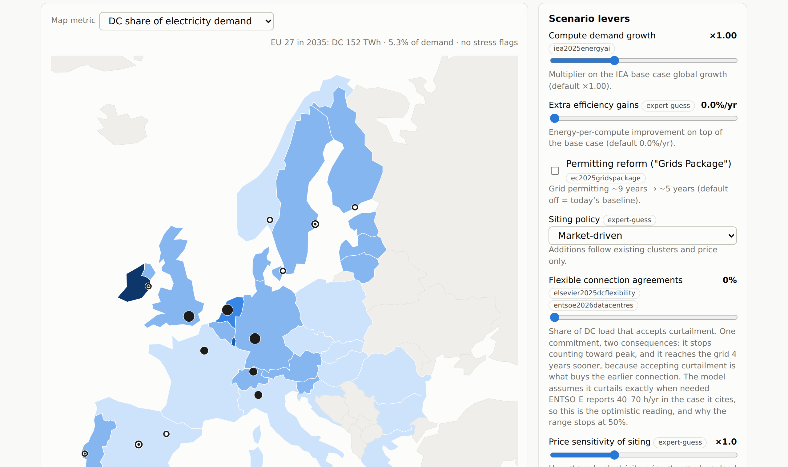
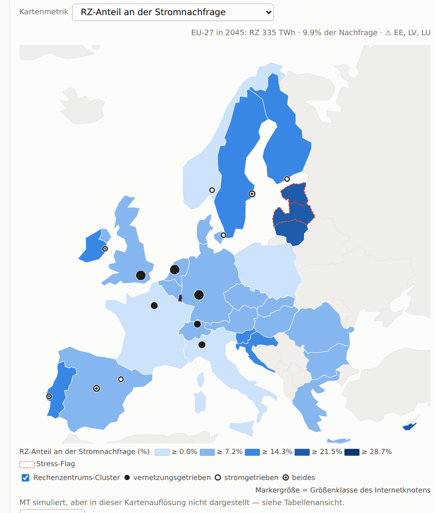
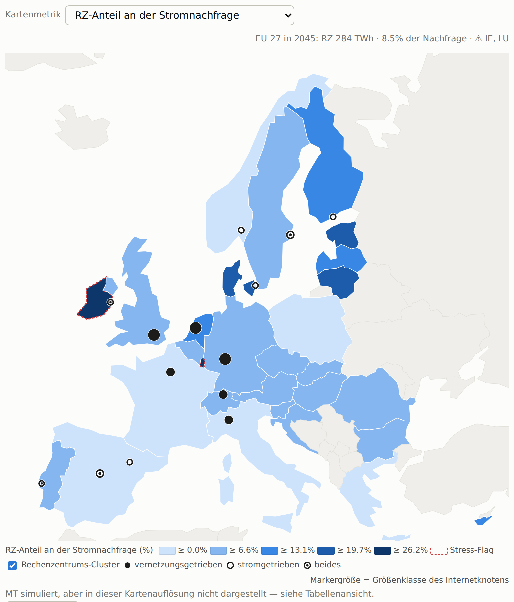
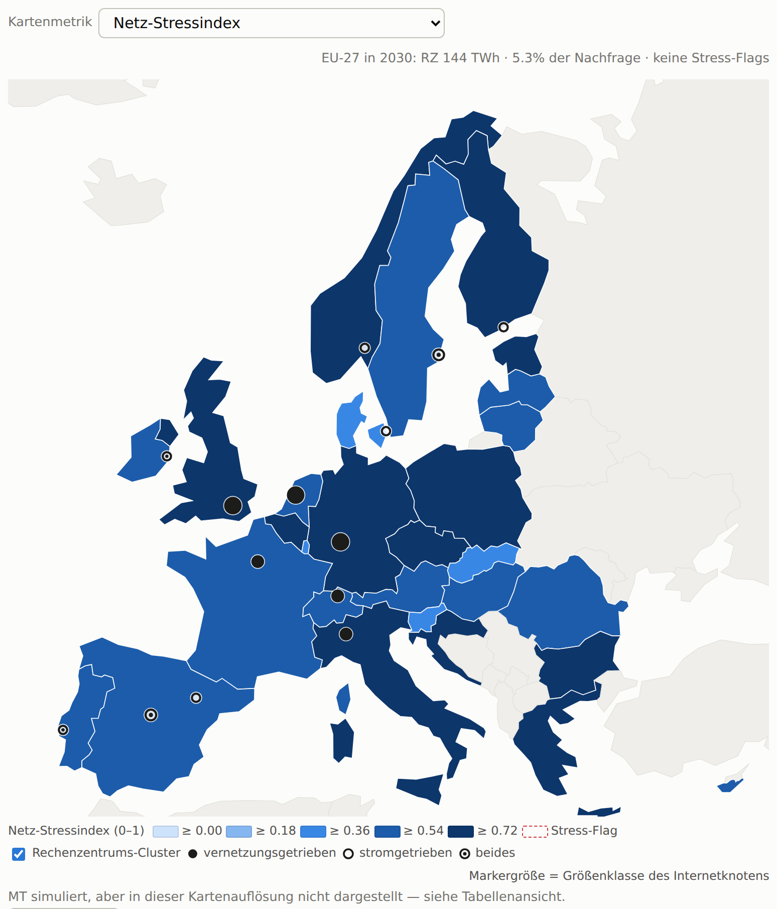
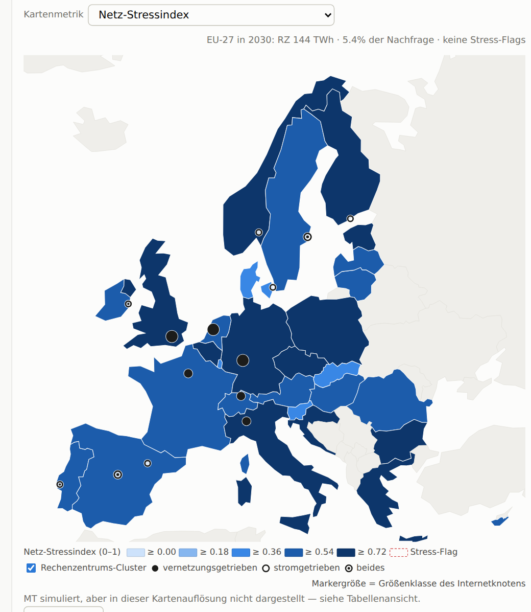
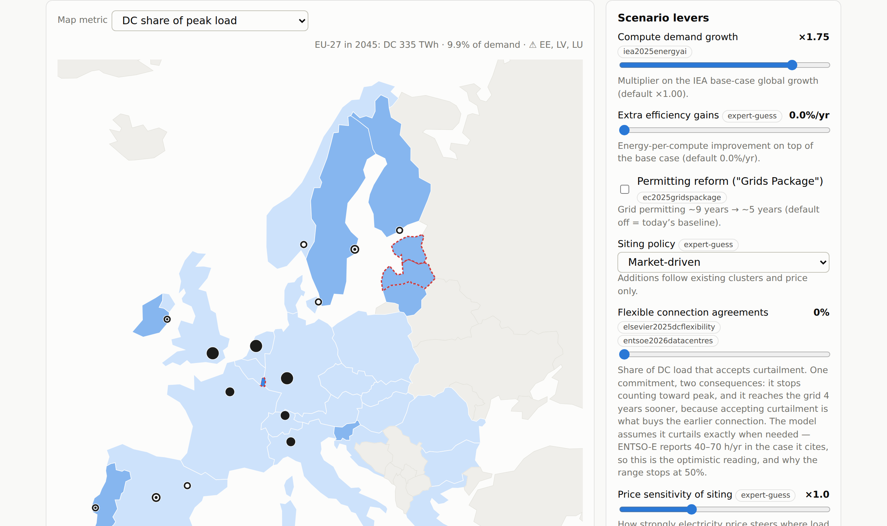
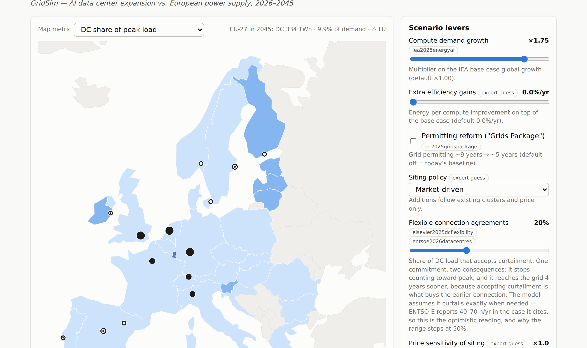
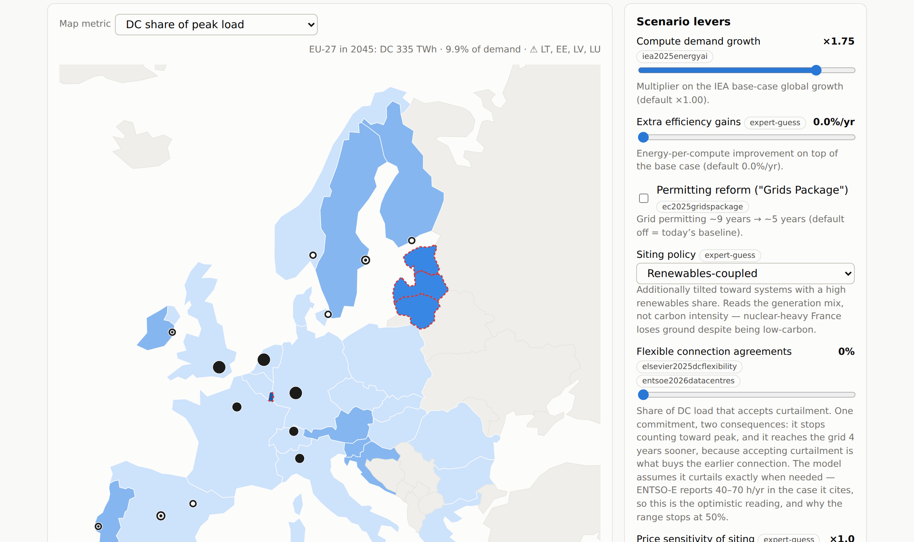
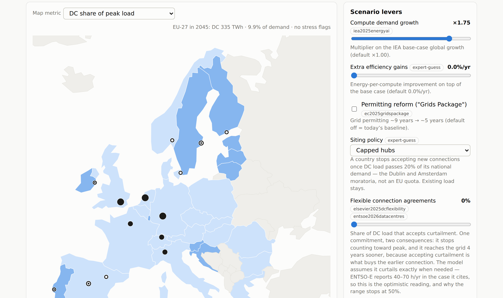

# Fallstudien mit dem Energie-4-AI-Simulator (P2)

**Stand:** 2026-09-03 · Datenbundle v2.4.0 · Erzeugt mit dem P2-Interface (Browser-Automation
via Playwright, Chromium headless). Alle Zahlen wurden **aus der Benutzeroberfläche
abgelesen** (Kopfzeile, Karte, Tabellenansicht), nicht aus dem Modellcode extrahiert — sie
sind über die Permalinks unter jeder Fallstudie exakt reproduzierbar.

> ⚠️ **Einordnung (Modellgrenzen):** Jahresenergiebilanzen auf einem vereinfachten
> NTC-Netz — kein Lastfluss, keine untertägige Auflösung; Länderauflösung (Hubs sind
> Metadaten); ein Teil der Länderparameter ist als `expert-guess` markiert
> ([Issue #4](https://github.com/Tobias-Run/Energie-4-AI/issues/4)). Die Szenarien sind
> **Explorationswerkzeuge, keine Prognosen.** Quellen je Parameter: `sources.bib` via
> Assumptions-Drawer; Datennutzung: [DISCLAIMER.md](DISCLAIMER.md).

---

## Vier Korrekturen, die frühere Befunde umgeworfen haben

Diese Fallstudien ersetzen die P1-Fassung vom 2026-07-04 und die erste P2-Fassung vollständig.
Drei Eingriffe haben Ergebnisse verändert, die vorher veröffentlicht waren — der dritte kam aus
einem externen Review ([Issue #7](https://github.com/Tobias-Run/Energie-4-AI/issues/7)).

**1. Berechnete statt geschätzte Spitzenlastfaktoren.** Die P1-Fassung behauptete, ein
Compute-Boom kippe 2045 neben Irland auch Litauen, Estland, Lettland und Malta in den
Stress-Flag. Diese Flags kamen aus geschätzten Spitzenlastfaktoren. Mit aus Ember-Daten
**berechneten** Faktoren (MT 1,50 → 1,98; LT 1,55 → 1,69; EE 1,55 → 1,62; LU 1,50 → 1,24)
verschwanden sie. Ein höherer Faktor bedeutet eine größere Spitzenlast im Nenner und damit
einen kleineren RZ-Anteil an der Spitze — genau die Größe, an der das Flag-Kriterium hängt.

> **Nachtrag (Korrektur 4):** „berechnet" hieß hier: aus einem **Interkonnektor-Datensatz**
> abgeleitet, nicht aus Lastdaten. Diese Faktoren sind inzwischen durch gemessene ersetzt, und
> Litauen ist im Boom-Fall **zurück** in der Flag-Liste. Der Absatz bleibt als Beleg dafür
> stehen, wie weit ein Befund tragen kann, dessen Parameter nie gemessen wurde.

**2. Die Anschlussrestriktion band gar nicht.** Beim Härten der Pipeline-Parameter zeigte
sich, dass die verfügbare Anschlusskapazität als Ländersockel **plus** dem Ausstoß einer
Verzögerungskette berechnet wurde — und diese Kette wird aus dem eigenen Bedarf desselben
Landes gespeist. Angebot war also eine verzögerte Funktion der Nachfrage: Setzte man
Dänemarks Anschlusskapazität auf **null**, behielt es immer noch 8,63 von 13,40 TWh, und die
Warteschlange blieb exakt null. Ein nationales Moratorium — genau das, was Energinet im März
2026 verhängt hat — war bei keinem Parameterwert abbildbar.

Die Länderkapazität begrenzt jetzt den **Zufluss** der Pipeline statt ihn zu ergänzen. Damit
bindet die Restriktion, es entstehen echte Warteschlangen, und die Genehmigungsdauer bleibt
unterhalb der Obergrenze wirksam. Details in [model-notes.md](model-notes.md).

**Was sich dadurch geändert hat:** Irland ist **nicht mehr geflaggt**. Seine eigene
Anschlussgrenze deckelt es bei 19,6 % der Landesnachfrage und 12,5 % der Spitzenlast, unter
der 15-%-Schwelle. Luxemburg ist im Zentralszenario das einzige geflaggte Land. Und Effizienz
bewegt die Flag-Liste jetzt sehr wohl — in der ersten P2-Fassung tat sie es nicht.

**3. Die Pipeline hatte keine Mindestvorlaufzeit.** Ein externes Review fand, dass
`stepPipeline` den Jahreszufluss zum Bestand addierte, _bevor_ die Abflüsse gerechnet wurden.
Folge: 3,7 % einer heute angekündigten Anschlusskapazität waren im selben Jahr fertig, und die
Initialisierung überschoss ihren eigenen stationären Zustand um 37,04 %. Beides ist behoben —
die Abflüsse werden jetzt auf den Beständen zu Jahresbeginn gerechnet. Ein einmaliges Vorhaben
liefert nun **zwei Jahre lang nichts**, bevor Zubau einsetzt.

Die Zahlen unten haben sich dadurch um Zehntel verschoben; die Aussagen nicht. Sichtbar wird die
Korrektur vor allem in Fallstudie 2: Die Warteschlangen sind jetzt um ein Vielfaches größer und
damit erstmals als Indikator brauchbar ([Issue #29](https://github.com/Tobias-Run/Energie-4-AI/issues/29)).

**4. Der Spitzenlastfaktor war aus der falschen Quelle.** `peakFactor` ist der Nenner des
Kriteriums, das die gesamte Flag-Liste bestimmt — und er hing an `ember2026interconnection`,
einem Datensatz über **Interkonnektor-Kapazitäten**, nicht über Last. Großbritannien war reine
Schätzung. Jetzt abgeleitet aus ENTSO-Es veröffentlichten **Stundenlastreihen 2019–2025**
(frei, ohne Zugangstoken), Zähler und Nenner aus derselben Reihe:
[`scripts/derive-peak-factors.mjs`](../scripts/derive-peak-factors.mjs).

Das Jahresmaximum war unbrauchbar — Dänemark 2020 hat als höchste Stunde 9.618 MW gegenüber
5.811 MW in der zweithöchsten, ein Datenfehler. Verwendet wird deshalb das 99,9-%-Perzentil,
und als Wert der Median über die nutzbaren Jahre.

**Die alten Werte lagen systematisch zu hoch:** 24 von 29 fielen, am stärksten Slowenien
(1,99 → 1,47), die Niederlande (1,86 → 1,43) und Dänemark (1,83 → 1,45). Luxemburg ging in die
Gegenrichtung (1,24 → 1,42).

**Was sich dadurch geändert hat:** Luxemburgs Spitzenanteil fällt 2045 von 18,4 auf **16,5 %**,
Irlands steigt von 11,1 auf **12,5 %**. Im Boom-Fall ist **Litauen zurück** in der Flag-Liste —
zum vierten Mal überquert es die 15-%-Schwelle. Der Standortdeckel (C4) räumt jetzt **alle**
Flags. Und 20 % Lastflexibilität genügen wieder, um Luxemburg zu lösen, wo zuvor 30 % nötig
waren. Zwei dieser Aussagen widerrufen frühere Korrekturen dieses Projekts.

**Der Trend beantwortet die zweite Hälfte der Frage — und ist jetzt angewendet.** Das
Verhältnis Spitze zu Mittel **steigt in 33 von 38 Ländern**, im Median um +0,0115 pro Jahr. Auf
21 Jahre sind das rund +0,24 — mehr als die soeben vorgenommene Korrektur. `peakFactor` bis 2045
konstant zu halten war damit **nicht** vertretbar, und die Richtung war bekannt; `peakFactorAt`
in `stressAdequacy.ts` schreibt den gemessenen Trend jetzt linear ab 2024 fort (nach unten
begrenzt bei 1 — Spitze kann per Definition nicht unter Mittel liegen).

> **Nachtrag (Korrektur 5):** Das ist eine echte Modelländerung, keine Parameterkorrektur, und
> Issue #39 verlangte ausdrücklich eine Abwägung, bevor sie umgesetzt wird: Der Trend bildet nur
> die Elektrifizierungsseite zweier gegenläufiger realer Effekte ab (steigende Grundlast-Spitze,
> gemessen, angewendet) — nicht die Gegenseite (wachsender, nahezu flacher RZ-Anteil senkt die
> Spitzigkeit des Gesamtsystems, real, aber unbelegt). Allein angewendet reichte das, um das
> einzige Zentralszenario-Flag 2045 vollständig zu räumen: Luxemburgs Spitzenanteil fiel von
> 16,5 % auf 14,5 %, unter die 15-%-Schwelle. Das blieb nicht so — siehe Korrektur 6.

> **Nachtrag (Korrektur 6):** Issue #30 B5 gibt der Netzanschlussrestriktion erstmals ein Wort bei
> der Standortwahl selbst, nicht erst danach: Länder mit engem Anschluss-Pipeline (Deutschland,
> Frankreich, Italien, die Niederlande, Dänemark, Irland) ziehen jetzt schon bei der Zuteilung
> weniger neue Last an, statt nur nachträglich weniger davon anschließen zu können. Das dorthin
> nicht mehr fließende Volumen landet überproportional in unbeschränkten Ländern — Luxemburg
> eingeschlossen. Kombiniert liegt Luxemburgs Spitzenanteil jetzt bei **15,9 %**, wieder über der
> 15-%-Schwelle — das Zentralszenario flaggt erneut Luxemburg. Irland liegt bei **14,2 %**, näher
> an der Schwelle als es aussieht, aber weiterhin nicht geflaggt, aus demselben Grund wie zuvor:
> seine eigene Anschlussgrenze hält es davor zurück. Der Boom-Fall bleibt bei drei Flags
> (EE, LV, LU) — der Rechendruck dort ist groß genug, dass keine der beiden Korrekturen ihn
> verschiebt. Beide Korrekturen sind für sich genommen begründet und wurden nicht aufeinander
> abgestimmt; dass die Flag-Liste jetzt zweimal gekippt ist, während sich die zugrunde liegenden
> Mengen kaum bewegt haben, ist selbst der Befund: eine Schwellenaussage über kleine Zahlen auf
> beiden Seiten einer Linie, keine robuste Beschreibung davon, wo sich Netzstress konzentriert.

---

## Fallstudie 1 — „Compute-Boom trifft Effizienz"

**Frage:** Was passiert, wenn die globale KI-Nachfrage 75 % über dem IEA-Basispfad wächst —
und wie viel davon können zusätzliche Effizienzgewinne der Rechenzentren wieder einfangen?

| Szenario              | Compute-Wachstum | Zusatz-Effizienz | Permalink                   |
| --------------------- | ---------------- | ---------------- | --------------------------- |
| Zentral (Referenz)    | ×1,00            | 0,0 %/Jahr       | `?y=2045&m=dcShareOfDemand` |
| A1 „Boom"             | ×1,75            | 0,0 %/Jahr       | `?g=1.75&y=2045&…`          |
| A2 „Boom + Effizienz" | ×1,75            | 2,0 %/Jahr       | `?g=1.75&e=0.02&y=2045&…`   |

**Ergebnis (EU-27, aus der UI-Kopfzeile):**

| Kennzahl                 | Zentral          | A1 Boom              | A2 Boom + Effizienz |
| ------------------------ | ---------------- | -------------------- | ------------------- |
| DC-Nachfrage 2035        | 153 TWh (5,4 %)  | 219 TWh (7,5 %)      | 200 TWh (6,9 %)     |
| DC-Nachfrage 2045        | 219 TWh (6,7 %)  | **337 TWh (10,0 %)** | **284 TWh (8,5 %)** |
| Stress-Flags 2045        | **LU**           | **EE, LV, LU**       | **LU**              |
| Irland: DC 2045          | 8,5 TWh (19,5 %) | 8,6 TWh (19,6 %)     | 8,5 TWh (19,5 %)    |
| Luxemburg: Anteil Spitze | 15,9 %           | 23,5 %               | 21,3 %              |
| Deutschland: DC 2045     | 40,5 TWh (7,0 %) | 53,8 TWh (9,1 %)     | 47,9 TWh (8,2 %)    |

**Befunde:**

1. **Der Boom hebt den DC-Anteil an der EU-Stromnachfrage auf 10,0 %** und die Nachfrage um
   +118 TWh über den Zentralpfad — grob der heutige Jahresverbrauch der Niederlande.
2. **2 %/Jahr Zusatz-Effizienz kauft ~53 TWh zurück** (337 → 284 TWh, −16 %) und **räumt
   Estland und Lettland von der Flag-Liste** — von drei geflaggten Ländern bleibt eines
   (Luxemburg). Anders als in der ersten P2-Fassung wirkt Effizienz damit nicht nur auf die
   Menge, sondern auch auf die Ränder — weil die gedeckelten Hubs Last in kleine Systeme
   abdrängen, wo Mengenreduktion über Schwellen entscheidet. Dass hier zwei statt eines Landes
   fallen, liegt an der Korrektur des Spitzenlast-Nenners (Issue #30, B1); dass es zwei und
   nicht mehr sind, liegt am gemessenen Spitzenlast-Trend (#39), der Litauen im Boom-Fall unter
   die Schwelle gedrückt hat, bevor Effizienz überhaupt greift.

   _Zur Lesart:_ Der Hebel wirkt seit
   [Issue #27](https://github.com/Tobias-Run/Energie-4-AI/issues/27) auf den **globalen**
   Zuwachs. Vorher multiplizierte er allein die europäischen Zubauten, womit „Effizienz"
   rechnerisch dasselbe war wie „Europa bekommt weniger Compute" — dieselben Chips liefen
   woanders, mit derselben Effizienz. Die europäischen Zahlen sind dadurch unverändert
   geblieben; verändert hat sich, dass jetzt auch die Weltnachfrage sinkt (2 594 → 2 171 TWh
   in 2045) und Europas Anteil daran stabil bleibt.

3. **Irland ist gegen den Boom fast vollständig unempfindlich: 8,5–8,6 TWh in allen drei
   Szenarien.** Seine Anschlussgrenze bindet in jedem Fall zuerst — seit Issue #30 B5 auch schon
   bei der Standortwahl selbst, nicht erst danach. Das ist die sichtbarste Folge der
   Pipeline-Korrektur — und es ist die Aussage, die das Modell über ein Land mit Moratorium
   überhaupt erst treffen kann.
4. **Luxemburg trägt den Boom stattdessen:** 15,9 % → 23,5 % der Spitzenlast. Klein,
   importabhängig, ohne Anschlussbeschränkung im Modell — es nimmt auf, was Irland und die
   anderen anschlussengen Länder abweisen. Im Zentralszenario reicht das inzwischen wieder für
   ein Flag (siehe Nachtrag zu Korrektur 6, oben); im Boom-Fall sowieso.


_Referenz: Zentralszenario 2035 — DC-Anteil an der Stromnachfrage._


_A1 „Boom" 2045: 337 TWh, 10,0 % — Estland, Lettland und Luxemburg geflaggt._


_A2 „Boom + Effizienz" 2045: 284 TWh, 8,5 % — Lettland fällt wieder heraus._

---

## Fallstudie 2 — „Grids Package unter Boom-Bedingungen: Wer bekommt die Last?"

**Frage:** Die europäische Permitting-Reform („Grids Package", Genehmigung ~9 → ~5 Jahre)
soll den Netzanschluss beschleunigen. Ändert sie, _wie viel_ KI-Last Europa anschließt —
oder _wo_ sie landet?

**Hebel:** B1 = `?g=1.75&y=2030&m=stressIndex` · B2 = zusätzlich `&r=1` (sonst identisch).

| Kennzahl                | B1 ohne Reform       | B2 mit Reform            |
| ----------------------- | -------------------- | ------------------------ |
| EU-27 DC 2030 / 2035    | 145 / 219 TWh        | 145 / 218 TWh            |
| **Irland** DC 2030      | 7,1 TWh (Q 0,028 GW) | **7,3 TWh** (Q 0,022 GW) |
| **Niederlande** DC 2030 | 10,5 TWh (Q 0,024)   | **11,5 TWh** (Q 0,000)   |
| **Dänemark** DC 2030    | 3,0 TWh (Q 0,003)    | **3,1 TWh** (Q 0,000)    |
| Schweden DC 2030        | 11,4 TWh             | 11,3 TWh                 |
| Spanien DC 2030         | 9,1 TWh              | 9,0 TWh                  |
| Norwegen DC 2030        | 4,3 TWh              | 4,1 TWh                  |

> **Nachtrag (Korrektur 6):** Diese Tabelle wurde durch Issue #30 B5 ein weiteres Mal
> verschoben — nicht nur bei den Warteschlangen. Die drei anschlussbeschränkten Länder ziehen
> jetzt schon bei der Standortwahl selbst weniger neue Last an, bevor überhaupt etwas an der
> Anschlusskapazität scheitern kann, also ist weniger übrig, das noch queuen könnte. Absolute
> Werte und Prozentsätze unten sind neu gerechnet; die Befunde selbst bleiben inhaltlich stehen.

**Befunde:**

1. **Die Reform ändert das EU-Total nicht — sie ändert die Landkarte.** 145 TWh mit und ohne.
   Verdrängte Nachfrage findet über den Spillover-Mechanismus ohnehin ein Zuhause.
2. **Sie wirkt jetzt messbar dort, wo es klemmt.** Die drei Länder mit belegter
   Anschlussbeschränkung gewinnen spürbar: Niederlande **+9,5 %**, Dänemark **+3,3 %**,
   Irland **+2,8 %**. Schweden, Spanien und Norwegen geben spiegelbildlich ab. In der ersten
   P2-Fassung war dieser Effekt gar nicht darstellbar, weil die Restriktion nicht band; seit
   der Überarbeitung der Vorlaufzeit ([#28](https://github.com/Tobias-Run/Energie-4-AI/issues/28))
   ist er zusätzlich deutlicher, weil die Reform jetzt eine Kante verschiebt statt eine Kurve
   zu verschmieren.
3. **Die Warteschlangen schrumpfen, und die Niederlande verschwindet ihre 2030 sogar
   vollständig.** Sie gehen von 0,024 auf 0,000 GW zurück — schnellere Genehmigung räumt den
   Rückstau ab, den die neue Standortwirkung von B5 ohnehin schon kleiner gemacht hat. Die
   physische Anschlusskapazität bleibt trotzdem die Obergrenze. Das ist der inhaltliche Kern:
   **Genehmigungsreform beschleunigt, sie erweitert nicht.**
4. **Ehrlicher Vorbehalt:** `baseConnectableGwPerYear` ist weiterhin `expert-guess` und seit
   der Korrektur der bindende Parameter — seit Issue #30 B5 wirkt es jetzt auch über die
   Standortwahl selbst, nicht mehr nur über die Anschlusskapazität. Länderaussagen aus dieser
   Fallstudie tragen diese Unsicherheit mit; die genaue Bandbreite unter Parametervariation ist
   für diese Fassung nicht neu vermessen worden.


_B1: Boom ohne Reform, 2030, Stress-Index._


_B2: Boom mit Reform, 2030, Stress-Index._

**Korrektur gegenüber der vorigen Fassung.** Dort stand, ein zweites Bild für B2 erübrige sich,
weil die beiden Karten bei dieser Metrik **byte-identisch** seien — und das war damals gemessen
richtig. Seit der Überarbeitung der Vorlaufzeit
([#28](https://github.com/Tobias-Run/Energie-4-AI/issues/28)) stimmt es nicht mehr: Die
Prüfsummen unterscheiden sich, weil die Reform jetzt genug Last nach NL, DK und IE verschiebt,
um deren Stress-Index sichtbar zu bewegen. Der Unterschied bleibt klein — die Reform verschiebt
Anschlusszeitpunkte und Warteschlangen, nicht die Gesamtmenge —, aber er ist nicht mehr null.
Deshalb steht das Bild jetzt hier.

---

## Fallstudie 3 — „Wohin mit der Last? Flexibilität und Standortsteuerung"

**Frage:** Was bewegt die Flag-Liste? Getestet werden die drei P2-Hebel, die an der
Verteilung ansetzen — alle unter Boom-Bedingungen (×1,75), Metrik **RZ-Anteil an der
Spitzenlast**, weil daran das Flag-Kriterium hängt (Schwelle 15 %).

| Szenario                   | Hebel              | Permalink                        |
| -------------------------- | ------------------ | -------------------------------- |
| C1 Referenz (Boom)         | —                  | `?g=1.75&y=2045&m=dcShareOfPeak` |
| C2 20 % Lastflexibilität   | `flexibilityShare` | `…&f=0.2`                        |
| C3 Standort nach Erneuerb. | `sitingPolicy`     | `…&s=renewables`                 |
| C4 Standort gedeckelt      | `sitingPolicy`     | `…&s=capped`                     |

**Ergebnis (2045, EU-27):**

| Kennzahl             | C1 Referenz | C2 Flex 20 % | C3 Erneuerbare     | C4 Gedeckelt |
| -------------------- | ----------- | ------------ | ------------------ | ------------ |
| EU-27 DC-Nachfrage   | 337 TWh     | 336 TWh      | 337 TWh            | 337 TWh      |
| Stress-Flags         | EE, LV, LU  | **LU**       | **LT, EE, LV, LU** | **keine**    |
| Emissionen (Europa)  | 29 Mt       | 29 Mt        | **28 Mt**          | 30 Mt        |
| LU: Anteil an Spitze | 23,5 %      | 20,4 %       | 24,2 %             | 12,1 %       |
| LV: Anteil an Spitze | 15,7 %      | 13,5 %       | 17,4 %             | 11,7 %       |
| EE: Anteil an Spitze | 16,2 %      | 13,7 %       | 18,4 %             | 10,8 %       |
| LT: Anteil an Spitze | 13,5 %      | 11,2 %       | 15,9 %             | 9,6 %        |

> **Diese Tabelle wurde inzwischen dreimal an einem Tag neu gerechnet** — nach der Korrektur des
> Spitzenlast-Nenners ([#30](https://github.com/Tobias-Run/Energie-4-AI/issues/30), B1), nach der
> Überarbeitung der Vorlaufzeit ([#28](https://github.com/Tobias-Run/Energie-4-AI/issues/28)) und
> nach Anwendung des gemessenen Spitzenlast-Trends ([#39](https://github.com/Tobias-Run/Energie-4-AI/issues/39),
> diese Fassung). Litauen war dabei mehrfach auf beiden Seiten der 15-%-Schwelle. Die Befunde
> unten stehen korrigiert statt still ersetzt; welcher Befund dabei gefallen ist, ist jeweils
> vermerkt.

**Befunde:**

1. **Das EU-Total ist gegen alle vier Hebel unempfindlich — 336–337 TWh in jedem Fall.** Die
   Standortsteuerung verschiebt Last, sie entfernt keine. Wer diese Hebel an der Gesamtkurve
   misst, misst nichts. _(Unverändert durch alle vier Korrekturen.)_
2. **„Grüne" Standortsteuerung senkt Emissionen und flaggt weiterhin ein Land mehr als die
   Referenz.** C3 lenkt Zubau in Systeme mit hohem Erneuerbaren-Anteil — in Europa überwiegend
   Nordics und Baltikum. Emissionen −1,7 Mt (−6 %), aber die Flag-Liste wächst von drei
   (Referenz) auf vier: Litauen steht unter dieser Standortpolitik über der Schwelle,
   13,5 % → **15,9 %**, obwohl es in der Referenz selbst darunter bleibt. Estland verschärft
   sich ebenso, 16,2 % → **18,4 %**. **Eine Politik, die nur auf den Strommix optimiert,
   verlagert das Adäquanzproblem in die Systeme, die es am wenigsten tragen können.**
3. **Lastflexibilität wirkt direkt auf das Flag-Kriterium.** 20 % nicht-firme DC-Last nimmt
   **Estland und Lettland** von der Referenz-Liste; von drei geflaggten Ländern bleibt eines.
   Luxemburg bleibt mit 20,4 % zu weit über der Schwelle. Wirksam, aber kein Freibrief.
4. **Der Deckel räumt alle Flags ab — und diese Aussage wurde hier schon zweimal gedreht.**
   Die P1-Fassung behauptete es, die Korrektur des Spitzenlast-Nenners (#30, B1) widerlegte es
   (Luxemburg bei 15,4 %, knapp darüber), und mit gemessenen Spitzenlastfaktoren (#39) stimmte
   es wieder. Unter C4 liegt Luxemburg bei **12,1 %** — trotz zweier weiterer Korrekturen seither
   (#39 Trend, #30 B5) bei praktisch demselben Wert, weil der Deckel selbst unverändert bei
   20 % der eigenen Nachfrage greift. Beide früheren Widerrufe waren zum Zeitpunkt der Messung
   korrekt. Was sie verbindet, ist ein Parameter, der nie gemessen worden war.
5. **Die Flag-Liste hängt an einem einzelnen Schwellenwert, und das ist hier inzwischen
   fünfmal vorgeführt worden.** Litauens Weg über die 15-%-Linie: darunter (P1) → darüber
   (#30 B1) → darunter (#28) → darüber (#39, gemessene Faktoren, 16,4 %) → **darunter** (#39,
   Trend angewendet, jetzt 13,5 % in der Referenz — aber weiterhin darüber unter „grüner"
   Standortsteuerung, Befund 2). Issue #30 B5 hat diese Position seither noch einmal verschoben
   (12,7 % → 13,5 %), ohne die Seite der Schwelle zu wechseln. Vier Modellkorrekturen und eine
   Datenkorrektur, von denen keine die Mengen nennenswert bewegt hat. Wer die Flag-Liste
   zitiert, sollte den Tornado-Chart danebenlegen — sie ist eine Schwellenaussage, keine
   robuste Größe.


_C1: Referenz. Luxemburg (23,5 %), Estland (16,2 %) und Lettland (15,7 %) über der 15-%-Schwelle; Litauen (13,5 %) darunter._


_C2: 20 % Lastflexibilität — Estland und Lettland fallen unter die Schwelle, Luxemburg bleibt geflaggt._


_C3: Standort nach Erneuerbaren — niedrigere Emissionen, aber das Baltikum rückt tiefer über die Schwelle, Litauen eingeschlossen._


_C4: Gedeckelte Standortwahl — keine Flags mehr; Luxemburg fällt auf 12,1 %._

---

## Reproduktion

```bash
npm install && npm run build && npm -w @energie4ai/web exec vite preview --port 4173
```

Dann die Permalinks aus den Tabellen an `http://localhost:4173/` anhängen, z. B.
`http://localhost:4173/?g=1.75&s=renewables&y=2045&m=dcShareOfPeak`. Die Screenshots dieses
Dokuments wurden genau so erzeugt (Chromium headless, Ausschnitt Kartenbereich).

Deterministisch: gleiche Hebel ⇒ exakt gleiche Zahlen (Seed-Reproduzierbarkeit, Spec §7).
Ein vollständiger 20-Jahres-Lauf kostet clientseitig 2–6 ms.
